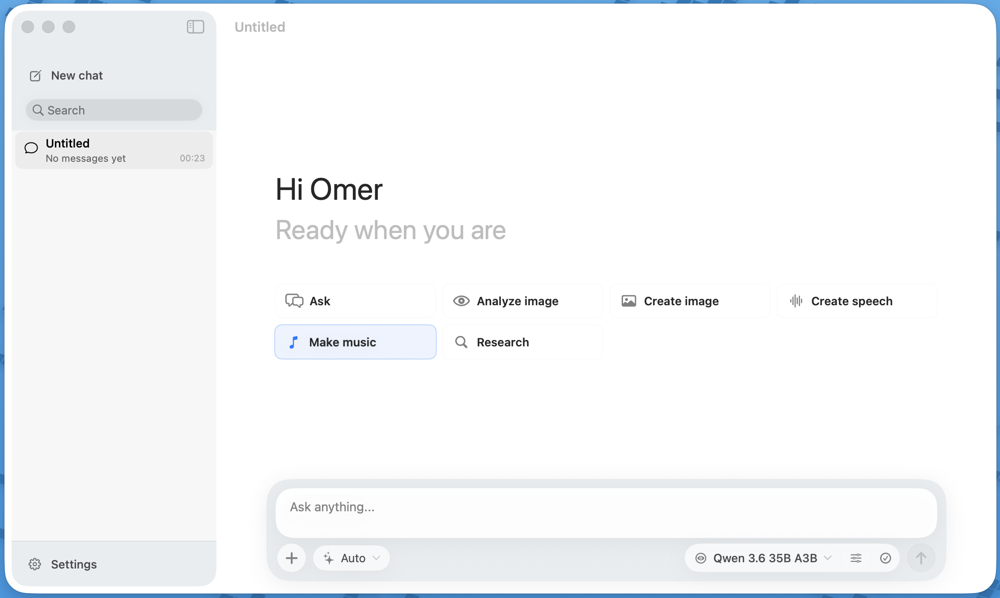
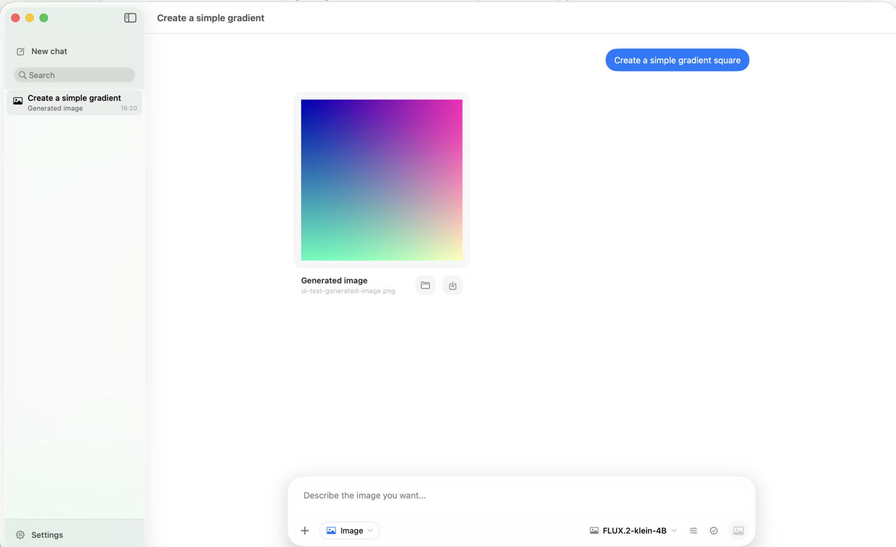
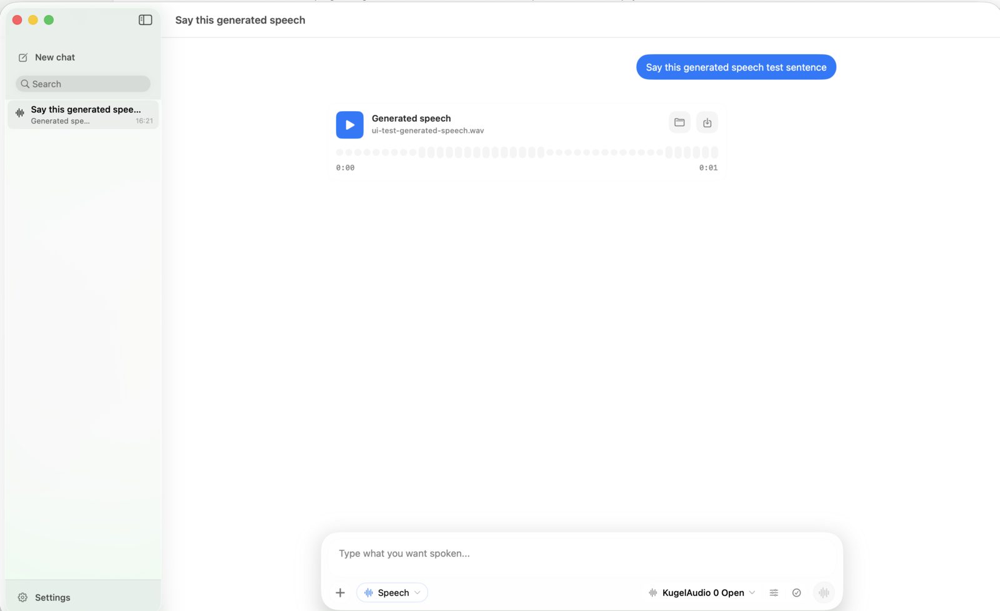
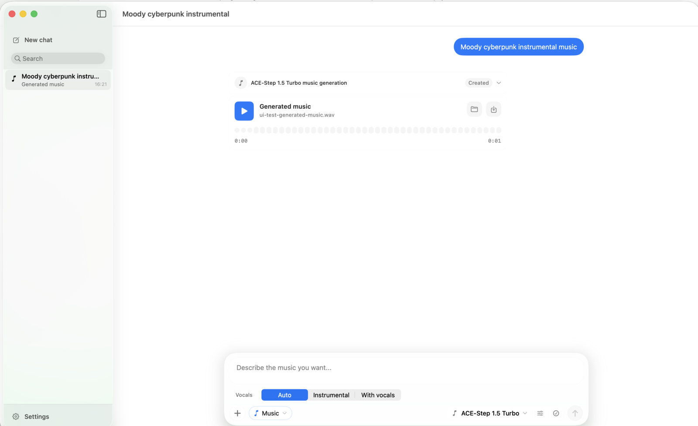
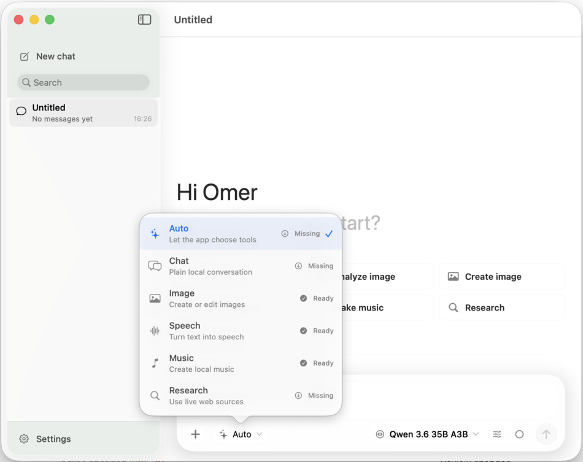
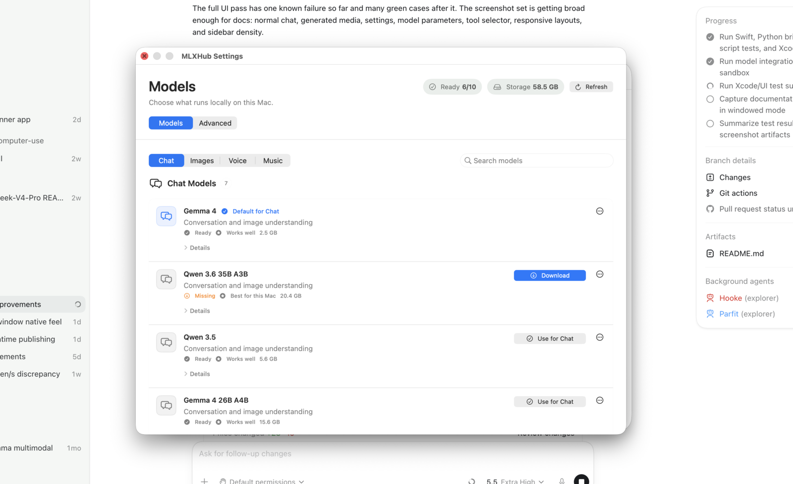

# MLXtra

A macOS-native GUI application for running and interacting with [MLX](https://github.com/ml-explore/mlx)-powered models on Apple Silicon. Built with SwiftUI and Python bridges for seamless local AI model execution.

## Features

### Model Support
- **Vision-Language Models (VLM)**: Chat with vision models like Qwen3.5 and Gemma4
- **Text-to-Image**: Generate images with mflux (Flux-based models)
- **Image Editing**: Edit images with Flux2KleinEdit
- **Text-to-Speech**: Generate speech with KugelAudio
- **Text-to-Music**: Create music with ACE-Step 1.5

### Core Capabilities
- **Tool Calling**: Models can use tools/functions for enhanced capabilities
- **Streaming Responses**: Real-time chat responses with typing indicators
- **Model Management**: Download and cache models locally with progress tracking
- **Multi-turn Conversations**: Persistent chat history with context
- **Drag & Drop**: Easy image attachment for vision tasks

## Screenshots

### Welcome Screen


### Chat Interface with Image Generation


### Speech Generation


### Music Generation


### Tool Selector


### Model Management


## Requirements

- macOS 14 (Sonoma) or later
- Apple Silicon Mac (M1, M2, M3, M4)
- Xcode 15+ (for building)

## Installation

### From Source

1. Clone the repository:
```bash
git clone https://github.com/mlxtra/mlxtra.git
cd mlxtra
```

2. Open the Xcode project:
```bash
open MLXtra.xcodeproj
```

3. Build and run the `MLXtra` scheme on `My Mac` (⌘+R).

On first launch, MLXtra checks the stable runtime channel and starts downloading
the Python/MLX runtime in the background when no compatible runtime is installed.

For a command-line build and launch, run:

```bash
Scripts/launch-debug-app.sh
```

### Runtime Setup

The app package does not embed the Python runtime. Runtime archives are published
as separate GitHub release assets and installed under
`~/Library/Application Support/MLXtra/runtimes/`.

To build a runtime archive for release work, run:

```bash
./Scripts/build-runtime-bundle.sh
```

This will:
- Create Python virtual environments
- Install required packages (mlx-vlm, mlx-lm, mflux, acestep, etc.)
- Write the local release runtime under `MLXtra/Resources/runtime/`

Runtime releases are referenced from `MLXtra/Resources/stable-channel.json`.

App binary updates use Sparkle with a GitHub-hosted appcast. Release builds
embed the Sparkle public EdDSA key and are published as notarized DMGs with
`Scripts/publish-app-release.sh`. See `docs/RELEASE_WORKFLOW.md`.

## Architecture

```
MLXtra/
├── MLXtra/                 # Main Swift source code
│   ├── Views/             # SwiftUI views
│   ├── ViewModels/        # Business logic
│   ├── Models/            # Data models
│   ├── Services/          # Core services
│   │   ├── AppUpdate/     # Sparkle app update integration
│   │   ├── Execution/     # Model execution engines
│   │   └── Runtime/       # Runtime management
│   └── Resources/         # Python bridges and fallback release metadata
│       ├── python_bridge.py    # Main Python bridge
│       ├── acestep_bridge.py   # ACE-Step music bridge
│       └── stable-channel.json # Runtime/catalog release channel
├── Scripts/               # Build scripts
└── Package.swift         # Swift Package Manager
```

## Usage

### Chat Interface
- Start a new chat from the sidebar
- Type messages or use `/image <path>` to attach images
- Models with tool support can execute functions automatically

### Model Selection
- Click the model dropdown to switch between available models
- Models are downloaded automatically on first use
- Download progress is shown in the sidebar

### Image Generation
- Select an image generation model (e.g., Flux2Klein)
- Enter a prompt describing the desired image
- Adjust parameters like steps, guidance scale, etc.

### Music Generation
- Use ACE-Step models
- Provide a caption describing the music style
- Optional: Add lyrics for vocal generation

## Development

### Project Structure

- **SwiftUI Frontend**: Modern declarative UI with macOS-native look
- **Python Bridge**: `python_bridge.py` handles model execution
- **Async/Await**: Concurrent model loading and generation
- **Actors**: Thread-safe model registries

### Key Components

#### Python Bridge (`python_bridge.py`)
- Transparent proxy to mlx-vlm, mlx-lm, and other MLX libraries
- Supports hot-swapping between models
- JSON-based communication with Swift

#### Model Executors
- `VLMExecutor`: Vision-language model execution
- `ImageExecutor`: Text-to-image generation
- Specialized bridges for ACE-Step (music) and mflux (images)

#### Chat System
- `ChatViewModel`: Manages chat state and model interactions
- `Message`: Represents chat messages with tool calls
- `ToolUse`: Function calling infrastructure

### Adding New Models

1. Add model entry to `runtime-manifest.json`
2. Implement executor in `Services/Execution/`
3. Update model registry in `python_bridge.py`

## Configuration

Settings are accessible via `MLXtra → Settings`:
- Default model selection
- Advanced generation parameters

Generated files are saved to the app library:
- Images: `~/Library/Application Support/MLXtra/GeneratedImages`
- Speech: `~/Library/Application Support/MLXtra/GeneratedSpeech`
- Music: `~/Library/Application Support/MLXtra/GeneratedMusic`

## Dependencies

### Swift
- SwiftUI (built-in)
- Foundation (built-in)
- Swift Markdown
- Sparkle

### Python (via downloaded runtime)
- mlx-vlm: Vision-language models
- mlx-lm: Language models
- mflux: Flux image generation
- acestep: Music generation
- transformers: Model utilities

## Troubleshooting

### Runtime is unavailable
Check internet access and the stable GitHub release. The app downloads the
runtime automatically when no compatible installed runtime is present.

### Model downloads fail
Check internet connection and Hugging Face access. Some models require authentication.

### Out of memory
Reduce model quantization or use smaller models. MLX automatically manages memory but large models may exceed available RAM.

## Contributing

See [CONTRIBUTING.md](CONTRIBUTING.md) for development setup, test commands, and
pull request expectations.

## Security

Please report vulnerabilities privately. See [SECURITY.md](SECURITY.md).

## License

MLXtra is released under the Apache License 2.0. See [LICENSE](LICENSE).

Third-party libraries, runtime packages, and model artifacts are licensed
separately by their respective owners. See
[THIRD_PARTY_NOTICES.md](THIRD_PARTY_NOTICES.md).

## Acknowledgments

- [MLX](https://github.com/ml-explore/mlx) by Apple
- [mlx-vlm](https://github.com/Blaizzy/mlx-vlm) by Prince Canuma
- [mflux](https://github.com/filipstrand/mflux) by Filip Strand
- [ACE-Step 1.5](https://github.com/ace-step/ACE-Step-1.5) for music generation
